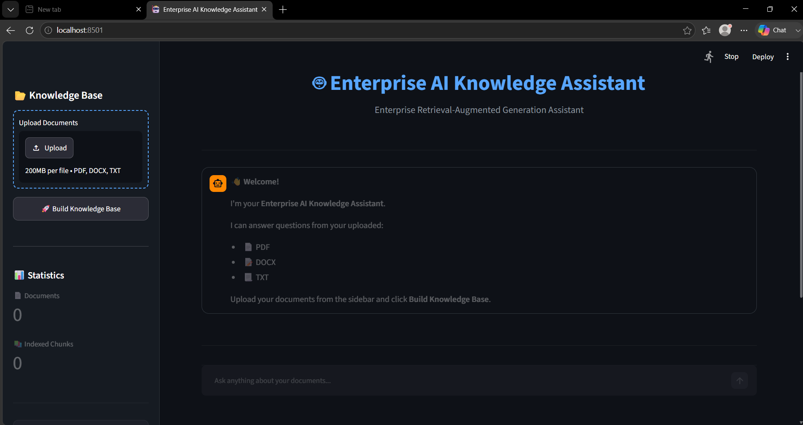
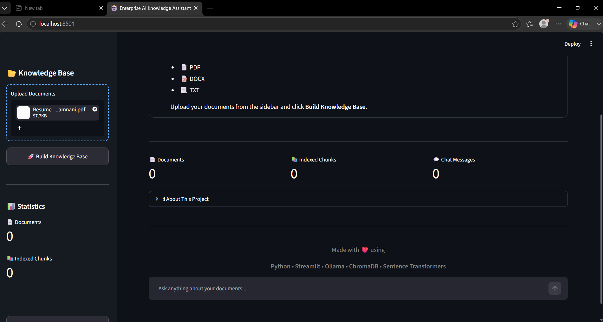
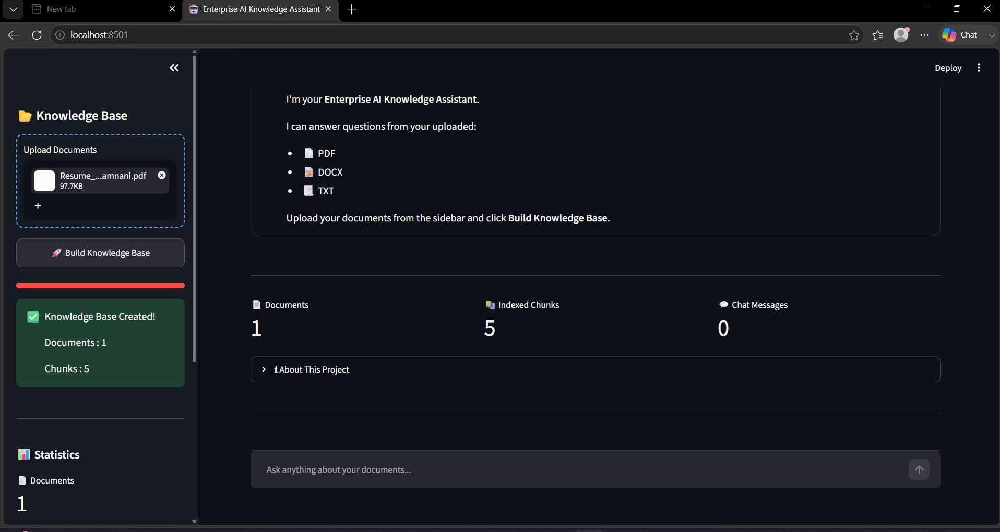
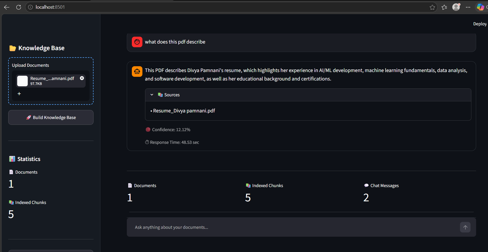

# 🤖 Enterprise AI Knowledge Assistant

An Enterprise-grade **Retrieval-Augmented Generation (RAG)** chatbot built using **Python**, **Streamlit**, **Ollama (Llama 3.2)**, **ChromaDB**, and **Sentence Transformers**. The assistant answers questions from uploaded PDF, DOCX, and TXT documents using semantic search and local LLM inference.

---

## 🚀 Features

- 📄 Upload PDF, DOCX, and TXT files
- 🧠 Semantic search using Sentence Transformers
- 📚 ChromaDB Vector Database
- 🤖 Local LLM responses using Ollama (Llama 3.2)
- 💬 ChatGPT-style chat interface
- 📊 Confidence Score
- 📑 Source Citation
- 📥 Download Chat History
- 🌙 Modern Dark UI
- 🔒 Fully Local (No External APIs)

---

## 🛠️ Tech Stack

- Python
- Streamlit
- Ollama
- Llama 3.2
- ChromaDB
- Sentence Transformers
- PyTorch
- pypdf
- python-docx

---

## 📂 Project Structure

```text
Enterprise_AI_Knowledge_Assistant/
│
├── uploaded_files/
├── vector_db/
├── screenshots/
├── app.py
├── config.py
├── rag_engine.py
├── vector_store.py
├── embeddings.py
├── chunker.py
├── document_loader.py
├── prompts.py
├── style.css
├── requirements.txt
└── README.md
```

---

## ⚙️ Installation

### 1. Clone the Repository

```bash
git clone https://github.com/divya-pamnani/Enterprise-AI-Knowledge-Assistant.git

cd Enterprise-AI-Knowledge-Assistant
```

### 2. Install Dependencies

```bash
pip install -r requirements.txt
```

### 3. Install Ollama

Download from:

https://ollama.com

### 4. Pull Llama 3.2

```bash
ollama pull llama3.2
```

### 5. Start Ollama

```bash
ollama serve
```

### 6. Run the Application

```bash
streamlit run app.py
```

---

## 💡 Usage

1. Launch the application.
2. Upload one or more PDF, DOCX, or TXT documents.
3. Click **Build Knowledge Base**.
4. Ask questions about the uploaded documents.
5. View answers with confidence scores and source citations.

---

# 📸 Screenshots

## 🏠 Home Page



---

## 📂 Upload Documents



---

## ✅ Knowledge Base Created



---

## 💬 Chat Response



---

# 🎯 Project Workflow

```text
                Documents
                    │
                    ▼
          Document Loader
                    │
                    ▼
            Text Chunking
                    │
                    ▼
      Sentence Transformer
            Embeddings
                    │
                    ▼
         ChromaDB Vector Store
                    │
                    ▼
          Semantic Retrieval
                    │
                    ▼
          Ollama (Llama 3.2)
                    │
                    ▼
            Generated Answer
```

---

# 📈 Future Improvements

- OCR support for scanned PDFs
- Image understanding
- Conversation memory
- Hybrid Search (BM25 + Dense Retrieval)
- Multi-user authentication
- Document summarization
- Streaming responses
- Docker deployment

---

# 👩‍💻 Author

**Divya Pamnani**

B.Tech Artificial Intelligence & Machine Learning

GitHub: https://github.com/divya-pamnani

---

# 📜 License

This project is intended for educational and portfolio purposes.

---

⭐ If you found this project useful, consider giving it a star on GitHub!