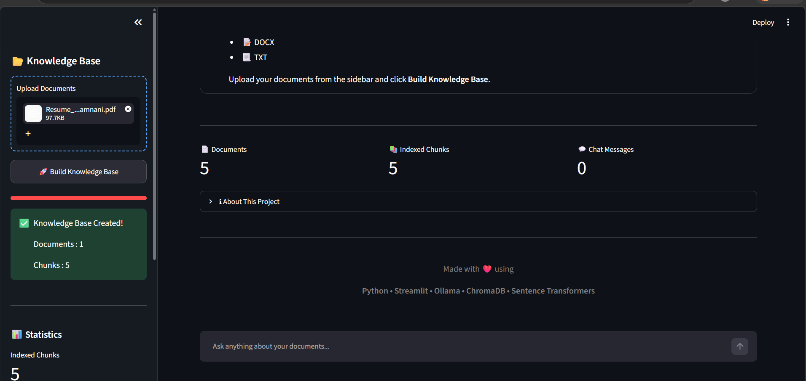

# 🤖 Enterprise AI Knowledge Assistant

An Enterprise-grade Retrieval-Augmented Generation (RAG) chatbot built using **Python**, **Streamlit**, **Ollama (Llama 3.2)**, **ChromaDB**, and **Sentence Transformers**. The assistant can answer questions based on uploaded PDF, DOCX, and TXT documents using semantic search and local LLM inference.

---

## 🚀 Features

- 📄 Upload PDF, DOCX, and TXT files
- 🧠 Semantic search using Sentence Transformers
- 📚 ChromaDB vector database
- 🤖 Local LLM responses using Ollama (Llama 3.2)
- 💬 ChatGPT-style interface
- 📊 Confidence score
- 📑 Source citation
- 📥 Download chat history
- 🌙 Modern dark UI
- 🔒 Fully local (no external API required)

---

## 🛠️ Tech Stack

- Python
- Streamlit
- Ollama
- Llama 3.2
- ChromaDB
- Sentence Transformers
- PyTorch
- pypdf
- python-docx

---

## 📂 Project Structure

```
Enterprise_AI_Knowledge_Assistant/
│
├── uploaded_files/
├── vector_db/
├── app.py
├── config.py
├── rag_engine.py
├── vector_store.py
├── embeddings.py
├── chunker.py
├── document_loader.py
├── prompts.py
├── style.css
├── requirements.txt
└── README.md
```

---

## ⚙️ Installation

Clone the repository:

```bash
git clone https://github.com/your-username/Enterprise_AI_Knowledge_Assistant.git

cd Enterprise_AI_Knowledge_Assistant
```

Install dependencies:

```bash
pip install -r requirements.txt
```

Install Ollama:

https://ollama.com

Pull the Llama 3.2 model:

```bash
ollama pull llama3.2
```

Start Ollama:

```bash
ollama serve
```

Run the application:

```bash
streamlit run app.py
```

---

## 💡 Usage

1. Launch the application.
2. Upload one or more PDF, DOCX, or TXT files.
3. Click **Build Knowledge Base**.
4. Ask questions related to the uploaded documents.
5. View answers along with confidence scores and document sources.

---

## 📸 Screenshots

Add screenshots here after running the application.

Example:

```
screenshots/
### Home Page



### Upload Documents

![Upload] (screenshots/uploaded.png.png)

### Knowledge Base Created

![Knowledge Base] (screenshots/knowledge base.png.png)

### Chat Response


---

## 🎯 Project Workflow

```
Documents
     │
     ▼
Document Loader
     │
     ▼
Text Chunking
     │
     ▼
Sentence Embeddings
     │
     ▼
ChromaDB Vector Store
     │
     ▼
Semantic Search
     │
     ▼
Ollama (Llama 3.2)
     │
     ▼
Final Answer
```

---

## 📈 Future Improvements

- OCR support for scanned PDFs
- Image understanding
- Conversation memory
- Hybrid Search (BM25 + Dense Retrieval)
- Multi-user authentication
- Document summarization
- Streaming responses
- Docker deployment

---

## 👩‍💻 Author

**Divya Pamnani**

B.Tech Artificial Intelligence & Machine Learning

---

## 📜 License

This project is developed for educational and portfolio purposes.